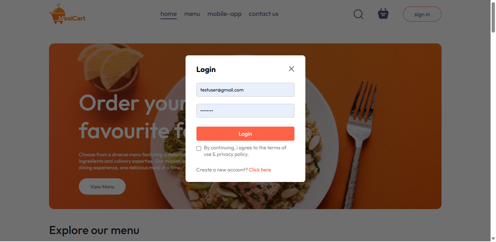
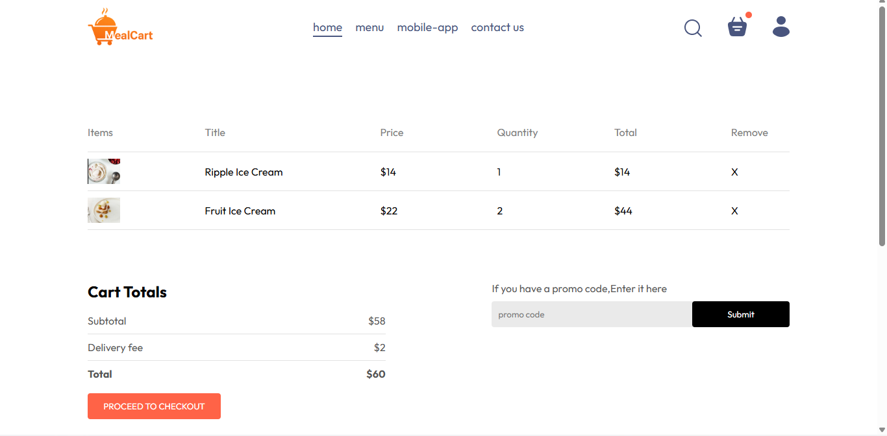
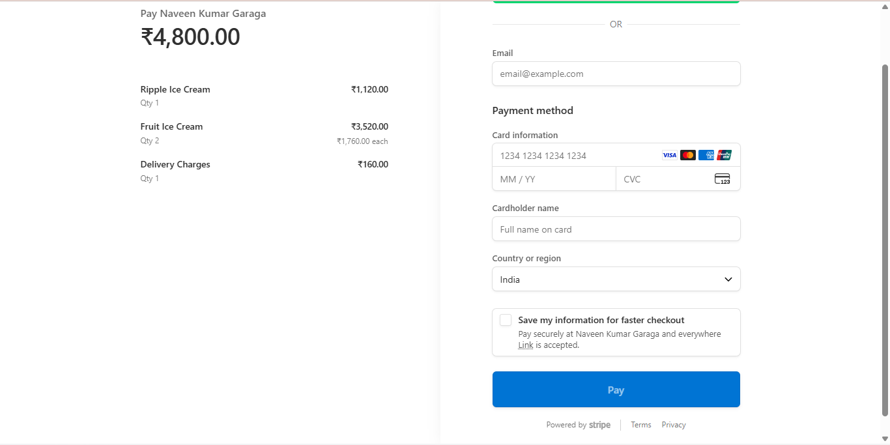
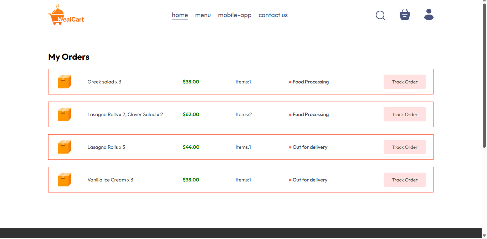
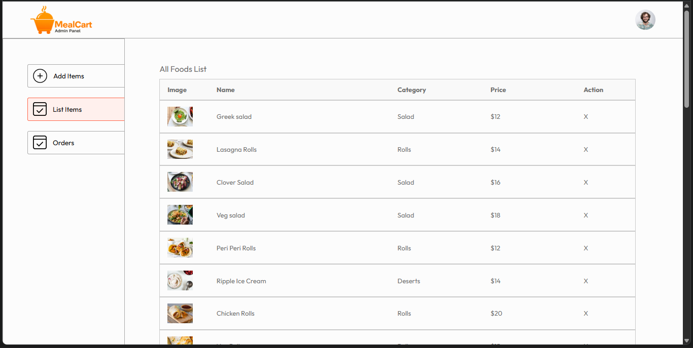
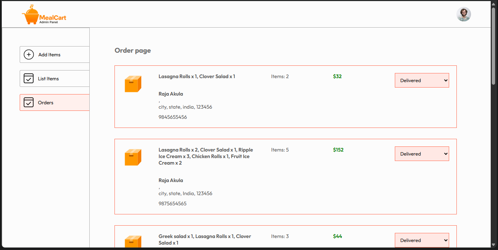

# 🍽️ MealCart

MealCart is a full-stack food ordering web application that allows users to browse food items, add them to a cart, place orders, and manage their accounts seamlessly. The project is designed with scalability, performance, and a clean user experience in mind.

---

## 🚀 Live Demo

* **Frontend:** *[Application link](https://meal-cart-pi.vercel.app/)*

---

## 🧩 Tech Stack

### Frontend

* React (Vite)
* HTML5, CSS3
* JavaScript (ES6+)
* Axios

### Backend

* Node.js
* Express.js
* REST APIs

### Database

* MongoDB

### Other Tools & Services

* Cloudinary (for image uploads)
* JWT (authentication)
* Render (backend deployment)
* Vercel (frontend deployment)

---

## ✨ Functionalities

### 👤 User Features

* User registration and login with JWT authentication
* Browse food items by category
* View food item details (image, price, description)
* Add/remove items from cart
* Update item quantity in cart
* Secure Stripe payment integration
* Place orders easily and efficiently
* View order history and order status
* Fully responsive design for mobile, tablet, and desktop

### 🛒 Cart & Payment

* Persistent cart management
* Automatic price calculation
* Secure checkout using **Stripe Payment Gateway**
* Payment verification on backend

### 🧑‍💼 Admin Panel Features

* Admin authentication
* Add new food items
* Update existing food items
* Delete food items
* Upload and manage food images
* View all user orders
* Manage and update order status (pending, preparing, delivered)

---

## 🏗️ Project Structure

```
MealCart/
├── frontend/                 # User-facing application
│   ├── src/
│   │   ├── components/
│   │   ├── pages/
│   │   ├── context/
│   │   └── assets/
│   ├── public/
│   └── package.json
│
├── admin/                    # Admin Panel
│   ├── src/
│   │   ├── components/
│   │   ├── pages/
│   │   ├── services/
│   │   └── assets/
│   ├── public/
│   └── package.json
│
├── backend/                  # Backend API
│   ├── controllers/
│   ├── models/
│   ├── routes/
│   ├── middleware/
│   ├── config/
│   └── server.js
│
└── README.md
```

---

## 🔐 Environment Variables

### Backend (`.env`)

```
PORT=5000
MONGO_URI=your_mongodb_connection_string
JWT_SECRET=your_jwt_secret
STRIPE_SECREET_KEY=your_stripe_secret_key
FRONTEND_URL=https://your-frontend-url
```

### Frontend (`.env`)

```
VITE_BACKEND_URL=https://your-backend-url
```

---

## ⚙️ Installation & Setup

### 1️⃣ Clone the repository

```bash
git clone https://github.com/your-username/mealcart.git
cd mealcart
```

### 2️⃣ Backend Setup

```bash
cd backend
npm install
npm run dev
```

### 3️⃣ Frontend Setup

```bash
cd frontend
npm install
npm run dev
```

---

## 📸 Screenshots

###  Login


### 🏠 Home Page


###  Menu 


### 🛒 Cart Page


### Place Order Page


### 💳 Stripe Payment


### User Orders Page


### 🧑‍💼 Admin FoodList


### 📦 Admin Orders Management


## 📈 Future Enhancements

* Real-time order tracking
* Email & SMS notifications
* Ratings and reviews
* Coupon & offers system

---


## 👨‍💻 Author

**Naveen Kumar Garaga**
📧 Email: [naveenkumargaraga@gmail.com](mailto:naveenkumargaraga@gmail.com)
🔗 GitHub | LinkedIn

---

⭐ If you like this project, don’t forget to give it a star!
